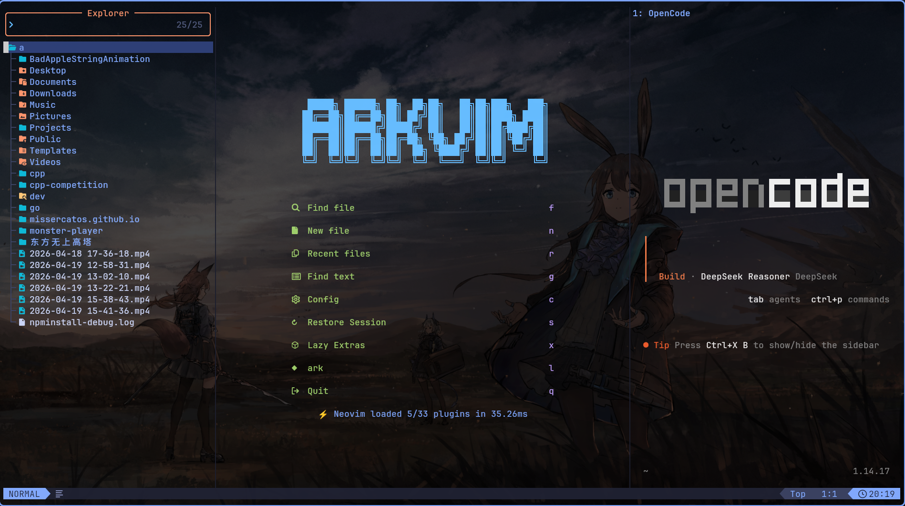

# 🔶 ARKVIM

```
    █████╗ ██████╗ ██╗  ██╗██╗   ██╗██╗███╗   ███╗
   ██╔══██╗██╔══██╗██║ ██╔╝██║   ██║██║████╗ ████║
   ███████║██████╔╝█████╔╝ ██║   ██║██║██╔████╔██║
   ██╔══██║██╔══██╗██╔═██╗ ╚██╗ ██╔╝██║██║╚██╔╝██║
   ██║  ██║██║  ██║██║  ██╗ ╚████╔╝ ██║██║ ╚═╝ ██║
   ╚═╝  ╚═╝╚═╝  ╚═╝╚═╝  ╚═╝  ╚═══╝  ╚═╝╚═╝     ╚═╝
```

> 基于 [LazyVim](https://github.com/LazyVim/LazyVim) 的现代化、高度可定制的 Neovim IDE 配置

## 🚀 项目简介

**ARKVIM** 是一个以 LazyVim 为基础的 Neovim 集成开发环境配置，深度融合了个性化定制与 [opencode](https://opencode.ai/) AI 编程助手扩展。它将 Neovim 的编辑能力与现代 IDE 功能、AI 辅助编程相结合，打造出高效、智能的代码编辑体验。

### ✨ 核心特性

- **🛠️ LazyVim 基础** – 基于业界领先的 LazyVim 配置，提供稳定、现代化的 Neovim 开发环境
- **🤖 AI 编程助手** – 集成 opencode AI 扩展，提供代码补全、重构建议、问题诊断等智能功能
- **🎨 个性化主题** – 采用 Tokyo Night 柔和配色方案，ark 部分为蓝色，vim 部分为绿色，视觉舒适
- **🔧 高度可配置** – 模块化设计，易于扩展和定制，满足不同开发需求
- **⚡ 快速启动** – 优化的插件加载机制，确保快速启动和流畅的使用体验

## 📸 截图展示

<!-- 在此处添加项目截图 -->


*说明：上图展示 ARKVIM 的实际运行界面，包含代码编辑、AI 辅助和主题效果。*

## 📥 安装指南

### 前提条件

1. **安装 Neovim** (版本 ≥ 0.9.0)
   ```bash
   # 使用包管理器安装，例如在 Ubuntu 上：
   sudo apt install neovim
   
   # 或者从源码编译最新版本
   ```

2. **安装 opencode** AI 助手
   ```bash
   # 按照 opencode 官方文档安装
   # 参考: https://opencode.ai/installation
   ```

### 配置步骤

1. **备份现有配置** (如有)
   ```bash
   mv ~/.config/nvim ~/.config/nvim.backup
   ```

2. **克隆 ARKVIM 仓库到正确位置**
   ```bash
   git clone https://github.com/your-username/arkvim.git ~/.config/nvim
   ```

3. **启动 Neovim 并自动安装插件**
   ```bash
   nvim
   ```
   - 首次启动会自动安装所有依赖插件
   - 安装过程可能需要几分钟，请耐心等待

4. **配置 opencode API 密钥** (如果需要)
   ```bash
   # 在环境变量中设置 opencode 密钥
   export OPENCODE_API_KEY="your-api-key-here"
   ```

## 🎯 使用说明

### 基本操作

- 启动界面：打开 Neovim 即可看到个性化的 ARKVIM 启动画面
- 插件管理：使用 `◆ ark` 按钮或 `:Lazy` 命令管理插件
- 文件查找：按 `f` 键快速查找文件
- 文本搜索：按 `g` 键进行全局文本搜索
- AI 助手：配置 opencode 后，使用相应快捷键调用 AI 功能.空格键+A+O.

### 主题切换

ARKVIM 默认使用 Tokyo Night 主题，如需切换主题：
```lua
-- 在 lua/config/options.lua 中修改
vim.cmd.colorscheme("tokyonight")
```

## 🙏 鸣谢

本项目基于以下优秀项目构建，特此感谢：

- **[Neovim](https://neovim.io/)** – 现代、高效的文本编辑器
- **[LazyVim](https://github.com/LazyVim/LazyVim)** – 优秀的 Neovim 配置框架
- **[opencode](https://opencode.ai/)** – 强大的 AI 编程助手
- **[Tokyo Night Theme](https://github.com/folke/tokyonight.nvim)** – 精美的配色方案

## 📄 许可证

本项目基于 MIT 许可证开源，详情请参阅 [LICENSE](LICENSE) 文件。

## 🤝 贡献指南

欢迎提交 Issue 和 Pull Request 来帮助改进 ARKVIM！

1. Fork 本仓库
2. 创建功能分支 (`git checkout -b feature/AmazingFeature`)
3. 提交更改 (`git commit -m 'Add some AmazingFeature'`)
4. 推送到分支 (`git push origin feature/AmazingFeature`)
5. 开启一个 Pull Request

## 📞 联系与支持

如有问题或建议，请通过以下方式联系：

- GitHub Issues: [问题反馈](https://github.com/your-username/arkvim/issues)
- 电子邮件: your-email@example.com

---

<p align="center">
  <sub>使用 ❤️ 构建，为开发者打造更好的编程体验</sub>
</p>
